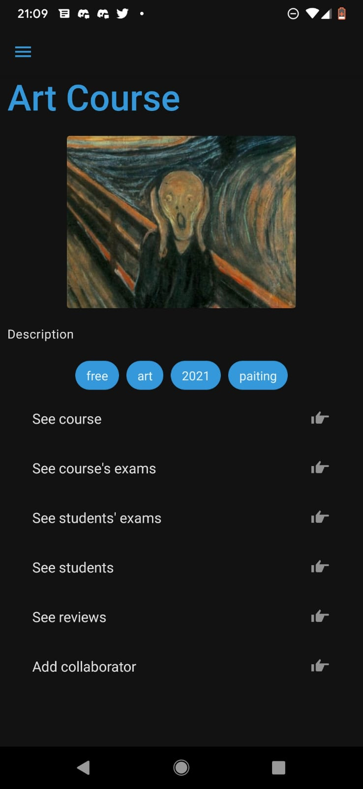

<!-- # taller2-ubademy-app
Aplicacion Mobile de Ubademy

Un texto para probar editar la pagina

 -->
# Manual de Usuario

  

## Iniciar sesión

Si se dispone de una cuenta en Ubademy, para ingresar a la aplicación se debe escribir el mail y la contraseña con las cuales se registraron a la app y tocar el botón de "Login".

  

### Login con Google:

Si se registró a la aplicación con una cuenta de Google, se debe tocar el botón de "Sign in with Google" y seleccionar la cuenta que se desea utilizar.

### Login con con datos biométricos:

Si por primera vez se toca la huella digital a la derecha del botón "Login" y se inicia sesión será posible realizar inicios de sesión a la cuenta de Ubademy utilizando únicamente la huella digital.

Si todavía no se dispone de una cuenta, se debe tocar el botón inferior "Sign up" para registrarse de forma normal o "Sign in with Google" para registrarse con una cuenta de Google.

## Registrarse

### Registro normal

Para poder registrarse se debe ingresar un mail válido y una contraseña de al menos seis carácteres. Se debe ingresar la misma contraseña en los dos últimos campos.

Una vez registrado, se debe ingresar el nombre que se desea mostrar en el perfil de usuario, la ubicación y los intereses. Esta información podrá ser editada en cualquier momento (ver Edición de Perfil).

  

### Registro con Google

Para poder registrarse con una cuenta de Google, se debe tocar el botón de "Sign in with Google" y seleccionar el mail que se desea utilizar. El registro será automático.

Si se desea volver a la pantalla de inicio de sesión, se debe tocar el botón de "Log in".

Un usuario apenas registrado posee como tipo de subscripción inicial "Free". Para cambiarla, ir a la sección "Modificación de subscripción".

## Pantalla de inicio y menú lateral

En un inicio de sesión o un registro exitoso, el usuario será dirigido a la pantalla de inicio.

En la pantalla de inicio se pueden realizar búsquedas. Para más información dirigirse a la sección de Búsquedas.

El menú lateral se accede tocando el ícono en la esquina superior izquierda. Los íconos representan:

* Explore: pantalla donde se pueden realizar busquedas de cursos o usuarios.
* Create a course: pantalla donde se puede crear un curso.
* Profile: pantalla donde se puede ver el perfil propio y editarlo.
* Chats: pantalla donde se encuentran los mensajes privados realizados con usuarios.
* Log out: cerrar sesión.

  

<!-- IMAGEN MENÚ LATERAL -->

## Perfil

### Visualización de perfil

Al ingresar a la pantalla del perfil se mostraran los datos del usuario.

* Datos privados: ubicación, tipo de subscripción, cursos.
* Datos públicos: email, nombre, imagen de perfil, intereses.

Los cursos mostrados están divididos en:

* Student: cursos donde el usuario se encuentra subscripto como estudiante.
* Collaborator: cursos donde el usuario fue registrado como colaborador del curso.
* Creator: cursos creados por el usuario.

Si el usuario no pertenece a ningún curso no se verá la opción de visualizarlos.

  

En caso de haber finalizado un curso, si se desea obtener un certificado de curso aprobado se puede tocar la badge. Se abrirá un menú de opciones donde se podrá indicar cómo se desea compartir el certificado.

<!-- IMAGEN DE BADGES -->

El botón de "Edit profile" lleva a la pantalla donde se puede editar el perfil.

El botón de "Change subscription" lleva a la pantalla donde se puede cambiar la subscripción.

### Edición de perfil

Para editar el perfil, se puede modificar los campos, la imagen y seleccionar nuevos intereses entre las opciones o eliminarlos. Si se desea guardar los cambios, se debe tocar el botón "Save profile". En caso contrario, basta con regresar a la anterior pantalla y los cambios serán borrados.

  

### Modificación de subscripción

Para modificar la subscripción se debe seleccionar de la lista de opciones.

Si se elige una subscripción de un tier menor a la actual, no se debe pagar y el cambio será automático.

Si se elige una subscripción de un tier mayor a la actual, se mostrará por pantalla el monto que se debe pagar para cambiar la subscripción. Si se selecciona el botón "Pay" se realizará la transacción y el monto indicado se descontará de la billetera. En el caso contrario, se cancelará el cambio de subscripción y no se descontará el dinero.

  

## Búsquedas

### Búsqueda de curso por categorias y subscripción

Para realizar una búsqueda de curso, existen las opciones de filtrar por categoría y por tipo de subscripción. Se debe seleccionar alguno de estos filtros y tocar el ícono de la lupa para realizar la búsqueda.

  

### Búsqueda de usuarios

Para buscar un usuario, se debe escribir un mail en la barra de búsqueda y tocar el ícono de la lupa. Esta acción nos llevará automáticamente al perfil de ese usuario, donde sólo se podrá ver la información pública del mismo.

  

## Cursos

Los cursos tienen distintos niveles de subscripción:
* Free
* Silver
* Golden
* Platinum

También, de momento existen las siguientes formas de clasificar un curso:
* Programming
* Art
* Music
* Math
* Chemestry
* Physics

### Pantalla principal del curso

La pantalla principal de un curso consiste en su nombre, su imagen de portada, su información y opciones cuya visualización dependen de quién sea el usuario.

* See course: pantalla con las imágenes y los videos (Accesible para: estudiantes, creador y colaboradores)
* See course's exams: lista con todos los exámenes disponibles en el curso (Accesible para: estudiantes, creador y colaboradores)
* See students' exams: lista de todos los exámenes realizados por estudiantes (Accesible para: creador y colaboradores)
* Add collaborator: permite agregar un colaborador al curso. (Accesible para: creador)
* See students: lista de todos los estudiantes subscriptos. (Accesible: creador)
* See reviews: reviews del curso. (Accesible: todos)
(Accesible: estudiantes, creador y colaboradores)

  

### Inscripción a curso

Para inscribirse a un curso se debe tocar el botón inferior "Subscribe".

Para que la subscripción sea aceptada, la inscripción del usuario debe ser igual o menor a la indicada en el curso junto al botón. Si se desea inscribirse a un curso con una subscripción mayor, primero se debe incrementar la subscripción.

  

### Desinscripción a curso

Para desinscribirse del curso se debe tocar el botón "Unsubscribe".

Si el usuario se desinscribe del curso, los exámenes realizados serán considerados y en caso de volver a inscribirse, no será necesario que los vuelva a realizar si se encuentran aprobados.

  

### Creación de curso

Para crear un curso se debe seleccionar el ícono "Create a course" en el menú lateral. 

Para que se pueda crear el curso, es necesario llenar todos los campos. Agregar tags, imágenes y videos es opcional.

Cuando se desee crear el curso se debe tocar el botón "Create Course".

  

Será posible editar el curso una vez creado. Esto sólo puede ser realizado por un creador.

### Edición de curso

Para editar un curso se debe ingresar al curso y la sección de "See course". Debajo de todo, se debe tocar el botón "Edit Course".

Se abrirá una pantalla donde se podrá editar la imagen de portada, la descripción, el tipo del curso, etc. También se puede agregar o eliminar imágenes y videos.

Cuando se desee finalizar con la edición se debe tocar "Update course". En caso que se desee descartar los cambios basta con volver a la anterior pantalla.

  

<!-- IMAGEN CURSO EDITAR -->

### Alta de colaborador

Para poder agregar un colaborador se debe tocar el botón "Add collaborator" que abrirá una ventana. Se debe escribir en el campo el mail del usuario que se desea agregar como colaborador y presionar aceptar. En caso contrario, se debe precionar cancelar.

Agregar un colaborador a un curso es una acción sólo realizable por el creador del curso.

<!-- IMAGEN CURSO ADD COLLABORATOR -->

### Visualizar el contenido del curso

El contenido dispuesto por el creador se encuentra en la sección "See course".

El contenido disponible consiste en:

* Videos: al seleccionar un video se reproducirá automáticamente.
* Imágenes: se puede explorar la galería de imágenes deslizando el dedo sobre la misma. Se puede realizar zoom tocando la lupa con el símbolo más sobre la imagen y salir de la pantalla de zoom tocando la lupa con el símbolo menos o deslizando la imagen hacia abajo.

<!-- IMAGEN CURSO -->

### Listado de alumnos

Pantalla donde se ve todos los alumnos subscriptos al curso. Permite filtrar por examen rendido.

<!-- IMAGEN LISTADO ALUMNOS -->

### Listado de exámenes

Pantalla donde se ven todos los exámenes rendidos por los alumnos. Se puede filtrar por corregido, no corregido o no filtrar.

<!-- IMAGEN LISTADO EXAMENES -->

### Reviews del curso

Pantalla donde se pueden ver los reviews del curso o dejar un review.

Para dejar un review se debe escribir uno en el campo indicado por "Leave a review", seleccionar la cantidad de estrellas con las cuales se califica el curso y una vez finalizado presionar "Send review".

En caso de que ya se haya dejado un review, no se podrá volver a dejar uno o editar el que ya fue publicado.

<!-- IMAGEN REVIEWS -->

## Exámenes

### Creación de examen

Para crear un examen se debe ingresar al curso y luego ingresar a la sección "See course's exams". En esa pantalla, se debe tocar el botón "Add exam" al final.

Se abrirá una nueva pantalla con el campo para indicar el nombre del examen y distintos botones:

* Add question: agregar una pregunta al examen para que los alumnos puedan contestarla.
* Create: finalizar la creación del examen.
* Go back: volver para atrás. Se perderán todos los cambios.

Si se desea eliminar una pregunta, se debe tocar la x en el extremo de la misma.

Una vez creado un examen, para que los alumnos puedan verlo y completarlo, es necesario publicarlo. Para publicar un examen, se debe ir a "See course's exams", seleccionar el examen que se desea publicar y tocar el botón "Publish". Una vez publicado, no podrá ser editado.

El examen no podrá ser creado si no tiene nombre o preguntas.

  

<!-- IMAGEN CREACION -->

### Edición de examen

Para editar un examen, es requisito que este no haya sido todavía publicado.

Para editar un examen, se debe ir a "See course's exams", seleccionar el examen que se desea editar y tocar el botón "Edit".

La pantalla funcionará igual que la de creación, además, aparecerán el nombre y las preguntas que contenía el examen.

<!-- IMAGEN DE EDICION -->

### Corrección de examen

Si se desea corregir un examen, se debe ir la sección "See students' exams". Se debe seleccionar el examen que se desea corregir. Se da la opción de dejar comentarios para cada pregunta y se debe mandar una calificación numérica entre uno y diez.

Los exámenes pueden ser filtrados según si se corrigieron, si no se corrigieron o ver todos.

<!-- IMAGEN DE CORRECCION -->

### Completar examen

Si se es estudiante y se desea completar un examen, se debe ingresar en el curso a "See course's exams". Allí se listarán todos los exámenes que se pueden realizar.

Si se selecciona un examen, se irá a una pantalla con las opciones.

* Do exam: esta opción lleva a una pantalla con las preguntas del examen. Para completarlo, se debe tocar los campos y escribir una respuesta. Para enviarlo, se debe tocar el botón "Send".
* See corrections: aquí se mostraran las correcciones del examen y la nota.

Si la calificación es 4 o menos, se podrá volver a realizar el examen. En caso contrario, no se podrá volver a realizarlo.

<!-- IMAGEN DE COMPLETAR -->
